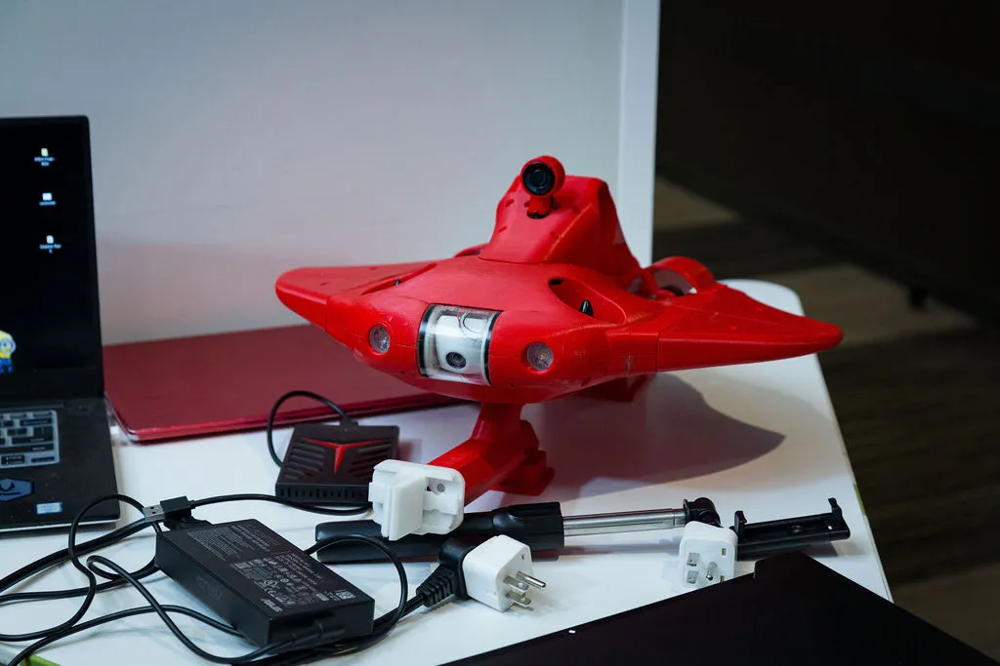

# 🤖 Underwater Remotely Operated Vehicle v2.0

A compact and efficient **Underwater Remotely Operated Vehicle (ROV)** designed for search and rescue missions in turbulent water bodies like the Ganga River. This system combines real-time video monitoring and intelligent object detection to support underwater navigation and victim identification.

---

## 🌍 Social Impact & SDG Alignment

This project addresses real-world humanitarian needs and supports multiple **United Nations Sustainable Development Goals (SDGs):**

- ✅ **SDG 3: Good Health and Well-being**  
  Prevents drowning fatalities through faster underwater detection in rescue operations.

- ✅ **SDG 6: Clean Water and Sanitation**  
  Adaptable for underwater inspection of water bodies to support environmental monitoring.

- ✅ **SDG 13: Climate Action**  
  Contributes to climate resilience through flood/disaster recovery and mitigation tools.

> 🎯 This is a high-impact **social innovation project** driven by sustainability, safety, and community well-being.

---

## 🏆 Achievements

- 🥇 **Winners – IEEE R10 International Robotics Competition (Tokyo, Japan)**  
  Presented the ROV v2.0 designed for search and rescue in turbulent water bodies like the Ganga River.

- 🥈 **Runners-up – PALS innoWAH! 2024, IIT Madras (IITM-PALS)**  
  Among 50+ teams selected across India. Developed **ROV v1.0** focused on disaster response and recovery in waterlogged areas.

## 🌟 Key Features
- 🎥 Real-time underwater video feed  
- 🧠 Machine learning-based object detection  
- 🛠️ Custom CAD design and FEA-tested frame  
- 💡 Integrated lighting for murky environments  
- 🤿 Tested in real-world turbulent waters  

---

## 📁 Repository Structure
- `Documentation.zip` – Project report and workflow  
- `Design_3D_Models.zip` – Complete 3D CAD files (STL + source)  
- `Ansys_Report.zip` – Structural and fluid simulation results  
- `New_ROV_Working_Video.zip` – Live footage of version 2.0  
- `Old_ROV_Working_Video.zip` – Early stage test video  
- `TESTING_VIDEOS.zip` – Controlled environment test results  
- `PPT.zip` – Final presentation deck  

---

## 🛠️ Tech Stack
- **Fusion 360 / SolidWorks** – Mechanical design  
- **ANSYS** – Fluid and stress simulations  
- **Python (YOLO)** – Real-time object detection  
- **BlueOS + Pixhawk** – Control system  
- **ROS2 Humble** – Robot middleware and simulation  
- **Git LFS** – For managing large files efficiently  

---

## 🙌 Acknowledgments
Special thanks to mentors and collaborators who supported the development and testing phases of this project.

---
